.. raw:: html

    

spatioloji_s: Image-Based Spatial Transcriptomics Analysis
==========================================================

**spatioloji_s** is a Python package for image-based spatial transcriptomics analysis,
supporting CosMx, MERFISH, and Xenium platforms.

It provides an integrated workflow from raw data loading through quality control,
processing, spatial analysis, and polygon-native cell-cell communication — all
within a consistent, polygon-aware data structure.

.. code-block:: python

   import spatioloji_s as sj

   # Load and process
   sp = sj.spatioloji(...)
   sj.processing.normalize_total(sp)
   sj.processing.log_transform(sp)
   sj.processing.pca(sp)
   sj.processing.umap(sp)
   sj.processing.leiden_clustering(sp)

   # Spatial analysis
   from spatioloji_s.spatial.polygon import build_buffer_graph
   graph = build_buffer_graph(sp, buffer_distance=15)

   # Cell-cell communication
   from spatioloji_s.ccc import CCCConfig, run_ccc
   result = run_ccc(sp, CCCConfig(group_col="cell_type"))

.. note::

   This package requires Python >= 3.12.

Getting Started
---------------

.. toctree::
   :maxdepth: 1

   installation
   usage-principles
   tutorials/index

API Reference
-------------

.. toctree::
   :maxdepth: 2

   api/index

Examples
--------

.. toctree::
   :maxdepth: 1

   examples/index

About
-----

.. toctree::
   :maxdepth: 1

   changelog
   contributing

Indices and tables
==================

* :ref:`genindex`
* :ref:`modindex`
